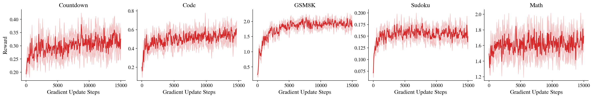
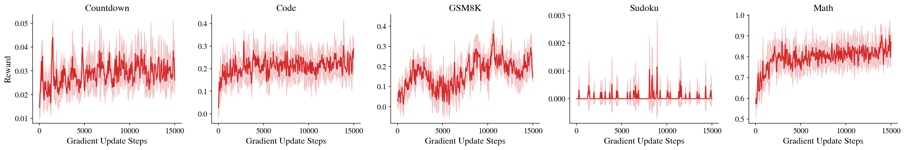

# RL

> 📄 Paper: [Scaling Reasoning in Diffusion Language Models](https://arxiv.org/abs/2504.12216) | 💻 Code: [github.com/dllm-reasoning/d1](https://github.com/dllm-reasoning/d1)

Resources and examples for reinforcement learning (GRPO) training of diffusion language models.

## Table of Contents
- [Files](#files)
- [GRPO](#grpo)

## Files
```
# Pipeline modules
dllm/pipelines/rl
├── __init__.py                     # Package initialization
└── grpo/
    ├── __init__.py                 # Package initialization
    ├── trainer.py                  # DiffuGRPOConfig and DiffuGRPOTrainer
    ├── datasets.py                 # Dataset loading and reward mapping
    └── rewards/
        ├── __init__.py
        ├── format.py               # Format reward functions
        ├── math.py                 # Math correctness rewards (gsm8k, math)
        ├── countdown.py            # Countdown task reward
        ├── sudoku.py               # Sudoku task reward
        └── code.py                 # Code correctness reward

# Example entry points
examples/rl/grpo
├── llada/
│   └── train.py                    # GRPO training for LLaDA
└── a2d/
    └── mdlm/
        └── train.py                # GRPO training for Tiny-A2D (MDLM)
```

## GRPO

We adapt [GRPO](https://arxiv.org/abs/2402.03300) (Group Relative Policy Optimization) for masked diffusion language models via `DiffuGRPOTrainer`, which replaces autoregressive generation with iterative denoising. The implementation follows the [d1/diffu-grpo](https://github.com/dllm-reasoning/d1) reference.

Supported datasets: [`gsm8k`](https://huggingface.co/datasets/openai/gsm8k), [`countdown`](https://huggingface.co/datasets/Jiayi-Pan/Countdown-Tasks-3to4), [`sudoku`](https://github.com/dllm-reasoning/d1/blob/main/dataset/4x4_sudoku_unique_puzzles.csv), [`math`](https://huggingface.co/datasets/ankner/math-500), [`code`](https://huggingface.co/datasets/KodCode/KodCode-Light-RL-10K)

### LLaDA

For example, to run GRPO on [`LLaDA-8B-Instruct`](https://huggingface.co/GSAI-ML/LLaDA-8B-Instruct) with [`gsm8k`](https://huggingface.co/datasets/openai/gsm8k) on 1 GPU:
```shell
accelerate launch \
    --config_file scripts/accelerate_configs/ddp.yaml --num_processes 1 \
    examples/rl/grpo/llada/train.py \
    --model_name_or_path GSAI-ML/LLaDA-8B-Instruct \
    --load_in_4bit True \
    --dataset gsm8k --max_steps 50 \
    --output_dir .models/LLaDA-8B-Instruct/grpo
```

To train with LoRA on 8 GPUs using DeepSpeed ZeRO-2:
```shell
accelerate launch \
    --config_file scripts/accelerate_configs/zero2.yaml \
    examples/rl/grpo/llada/train.py \
    --model_name_or_path GSAI-ML/LLaDA-8B-Instruct \
    --load_in_4bit True --lora_r 128 --lora_alpha 64 --lora_dropout 0.05 \
    --dataset gsm8k \
    --max_steps 15000 --learning_rate 3e-6 \
    --num_generations 6 --per_device_train_batch_size 6 \
    --gradient_accumulation_steps 2 --num_iterations 12 \
    --block_size 32 --steps 128 \
    --p_mask_prompt 0.15 --beta 0.04 --epsilon 0.5 \
    --sync_ref_model True --ref_model_sync_steps 64 \
    --output_dir .models/LLaDA-8B-Instruct/grpo
```

If you are using Slurm and want to train across, for example, 2 nodes (16 GPUs total), run:
```shell
sbatch --nodes=2 --gres=gpu:8 scripts/train.slurm.sh \
    --accelerate_config "zero2" \
    --script_path "examples/rl/grpo/llada/train.py" \
    --model_name_or_path GSAI-ML/LLaDA-8B-Instruct \
    --load_in_4bit True --lora_r 128 --lora_alpha 64 --lora_dropout 0.05 \
    --dataset gsm8k \
    --max_steps 15000 --learning_rate 3e-6 \
    --num_generations 6 --per_device_train_batch_size 6 \
    --gradient_accumulation_steps 2 --num_iterations 12 \
    --block_size 32 --steps 128 \
    --p_mask_prompt 0.15 --beta 0.04 --epsilon 0.5 \
    --sync_ref_model True --ref_model_sync_steps 64 \
    --output_dir .models/LLaDA-8B-Instruct/grpo
```

Example reward curves across the five GRPO datasets (applied directly to [`LLaDA-8B-Instruct`](https://huggingface.co/GSAI-ML/LLaDA-8B-Instruct) without any intermediate SFT):



### Tiny-A2D (MDLM)

For example, to run GRPO on [`Qwen3-0.6B-diffusion-mdlm-v0.1`](https://huggingface.co/dllm-hub/Qwen3-0.6B-diffusion-mdlm-v0.1) with [`gsm8k`](https://huggingface.co/datasets/openai/gsm8k) on 1 GPU:
```shell
accelerate launch \
    --config_file scripts/accelerate_configs/ddp.yaml --num_processes 1 \
    examples/rl/grpo/a2d/mdlm/train.py \
    --model_name_or_path dllm-hub/Qwen3-0.6B-diffusion-mdlm-v0.1 \
    --dataset gsm8k --max_steps 50 \
    --output_dir .models/a2d/Qwen3-0.6B-diffusion-mdlm-v0.1/grpo
```

To train with LoRA on 8 GPUs using DeepSpeed ZeRO-2:
```shell
accelerate launch \
    --config_file scripts/accelerate_configs/zero2.yaml \
    examples/rl/grpo/a2d/mdlm/train.py \
    --model_name_or_path dllm-hub/Qwen3-0.6B-diffusion-mdlm-v0.1 \
    --lora_r 128 --lora_alpha 64 --lora_dropout 0.05 \
    --dataset gsm8k \
    --max_steps 15000 --learning_rate 3e-6 \
    --num_generations 6 --per_device_train_batch_size 6 \
    --gradient_accumulation_steps 2 --num_iterations 12 \
    --block_size 32 --steps 128 \
    --p_mask_prompt 0.15 --beta 0.04 --epsilon 0.5 \
    --sync_ref_model True --ref_model_sync_steps 64 \
    --output_dir .models/a2d/Qwen3-0.6B-diffusion-mdlm-v0.1/grpo
```

If you are using Slurm and want to train across, for example, 2 nodes (16 GPUs total), run:
```shell
sbatch --nodes=2 --gres=gpu:8 scripts/train.slurm.sh \
    --accelerate_config "zero2" \
    --script_path "examples/rl/grpo/a2d/mdlm/train.py" \
    --model_name_or_path dllm-hub/Qwen3-0.6B-diffusion-mdlm-v0.1 \
    --lora_r 128 --lora_alpha 64 --lora_dropout 0.05 \
    --dataset gsm8k \
    --max_steps 15000 --learning_rate 3e-6 \
    --num_generations 6 --per_device_train_batch_size 6 \
    --gradient_accumulation_steps 2 --num_iterations 12 \
    --block_size 32 --steps 128 \
    --p_mask_prompt 0.15 --beta 0.04 --epsilon 0.5 \
    --sync_ref_model True --ref_model_sync_steps 64 \
    --output_dir .models/a2d/Qwen3-0.6B-diffusion-mdlm-v0.1/grpo
```

Example reward curves across the five GRPO datasets (applied directly to [`Qwen3-0.6B-diffusion-mdlm-v0.1`](https://huggingface.co/dllm-hub/Qwen3-0.6B-diffusion-mdlm-v0.1) without any intermediate SFT):



For Slurm and full hyperparameter settings, see the docstrings at the top of each training script.
